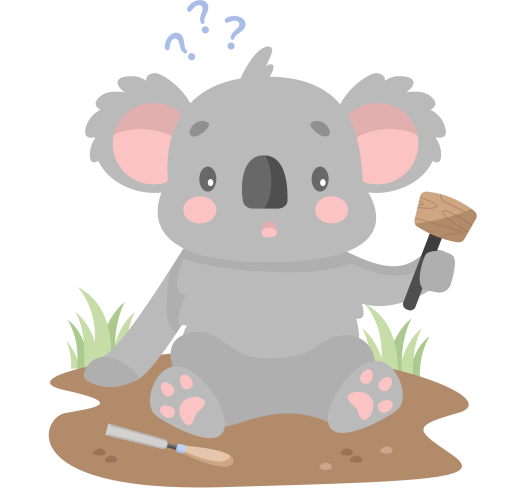

# Curious Koalas

Curious Koalas is a non-profit initiative by [Ballarat Hackerspace](https://www.ballarathackerspace.org.au) making STEM learning hands-on, accessible, and meaningful for families across Victoria.

We create open-source DIY project kits for parents and children to build together — from simple woodwork and beginner-friendly electronics, to creative coding and up-cycled engineering. These aren’t just projects — they’re powerful learning moments that build skills, confidence, and connection.

Our online platform will offer step-by-step guides — from wind-powered cars and light-up bedroom lamps to programmable robots. It will also connect families with libraries, maker spaces, and other helpful supporting resources. And for those who need it, we’ll offer complete kits — thoughtfully packaged and ready to use at home. All our projects are completely open source, with every piece of information on how to reproduce being freely available.

Best of all we're 100% non-profit and volunteer run.

Together, we can inspire the next generation of makers.
